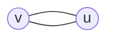
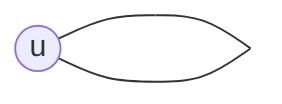
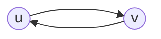

### Binds
>$\renewcommand{\comp}[1]{\overline{#1}}$
>$\newcommand\col[1]{\begin{pmatrix}#1\end{pmatrix}}$
>$\newcommand\contra{\Rightarrow\!\Leftarrow}$
>$\newcommand\ajc{\leftrightarrow}$ 

$G_s$ - simple graph
$+$ before a theorem means not in lecture
---
## What is a graph
### Def'n: simple grapth
> a simple grapth G=(V,E) is a pair of sets.
> 1.  V = sets of vertices of G (points)
> 2.  E = set of edges, which are unordered pairs (2-elements subsets) of V

Remark:
This definition doesn't allow:
1. parrallel or multiple edges  $~~e_1 = \{u,v\},~~e_2=\{v,u\}$ (the same)

2. loop $e=\{u,u\}$ (not an unordered pair)

If we want to contain multiple edges and loops we use multiple sets.

### Terminology and notation
> $e=\{u,v\}$:
> - e is incidnet tu u, v
> - endpoints of e are u,v
> - u,v are adjacent 
> 
> G = (V,E)   $~~~V\neq \emptyset~~~$   V is finite
> V = V(G), E=E(G) - emphsising G
> |V|, |E| - cardinlity

### Example
> 4 people, pairs of people. Adjecent if $\exists$ a common person.
V = pairs
E = common person

v = {ab,ac,ad,bc,bd,cd}  |V| = 6
![[Pasted image 20230227211610.png|300]]

### Def'n: Degree of vertex v of G  
> = # of edges incident to v (!loops are counted twice)
> $d_G(v)$

### Handshake lemma
> $$\sum_{v\in V(G)}d(v)=2|E(G)|$$

Proof:
Each handshake (=edge) is counted twice for each person(=vertices)

##### Corollary
> The # of odd degree vertice in any graph should be even

Proof: 
Otherwise $\sum d(v)=odd$ but $\sum d(v) = even = 2n$  contradiction

### Def'n: Directed Grapths
> G=(V,E) is a directed grapth, if the edges of G are ordered pair of verteces
> $e =(u,v)\neq(v,u)$
> - u-starting | inicial point fo e
> - v-endpoint of e

>ind(v) = # edges with the v as inicial point
>outd(v) = # number of edges with v as endpoint
>$$\sum_{v\in V(G)}ind(v)+\sum_{v\in V(G)}outd(v)=|E|+|E|=2|E|$$

### Def'n: Compliment
>Compliment of $G=(V,E)$ is the grapth $\comp G =(V',E')$
>- $V'= V$
>- $E' = \{v,u\}\not\in E(G)~~~~~\forall u,v\in V$

### Def'n: Complete grapth
> The complete grapth $K_n=(V,E)$:
> - $|V|=n$
> - $E(K_N)$ = all the possible pairs of V
> $$E(G)\cup E(\comp G)=E(K_{|V|})$$

![[CompleteGraphs_801.svg]]

#### Proposition
> $d_{K_n}(v)=n-1~~~\forall v\in V(K_n)$
> $$|E(K_n)|=\frac{\sum d(v)}{2}=\frac{n(n-1)}{2}$$

Terminology:
>$d_G(v)=k~~~~~\forall v\in V(G)\iff$ G is k-regular grapth

##### Corollary 
> $d_{\comp G}(v)+d_G(v)= d_{K_n}(v)=n-1$
> $|E(\comp G)|+|E(G)| =|E(K_n)|=\frac{n(n-1)}{2}$

### Def'n: Subgrapth
>Subgrah of grapth $G=(V,E)$ is $G'=(V',E')$
> - $V'\subseteq V$
> - $E'\subseteq E$
> - $e=\{u,v\} \in E' \implies u,v \in V'$

#### Def'n: Deletion
> deletion of vertex from G $\implies$ delete all the edges incident to it
> deletion of an edge from G $\implies$ delete the edge keep the endpoints
>Than a subgrapth can be obtained by a sequence of deletion of vertexes and edges form G.
![[Pasted image 20230227223233.png|300]]

#### Def'n: Induced Subgrapth
> if we only delete verteces from G
> 
#### Def'n: Spaning Subgrapth
> if we only delete edges from G

### Def'n: Isomorpthism 
>$G=(V,E)≅ G'=(V',E')$
>$\exists$ 1-to-1 mapping $f : V \longleftrightarrow V'$
>$\{u,v\}\in E(G) \iff \{f(u), f(v)\}\in E'(G')$

![[0xoLY.jpg|500]]

---

## Connectedness of graph
###  Def'n Walk
>Walk $\in$ G=(V,E) = $(v_0, e_1,v_1, e_2, v_2...e_k, v_k)$
>A closed walk  $v_k=v_0$
>length(walk)=#of edges

### Def'n Trail
> Trail $\in$ G=(V,E) = a walk without repeted edges
> A closed trail  = circuit

### Def'n Path
> Path $\in$ G=(V,E) = a walk without repedted verteces ($\implies \not \exists$ repeted edges)
> A closed path = cycle  $v_k=v_0$

$C_0 \iff$  vertex
$C_1 \iff$  loop
$C_2  \iff$ parrallel edges
$C_1 \iff$ triangle
G is simple $\iff C_n ~~~~~ n\geq 3$

### Walk has Path Theorem
>$\exists W_{u\rightarrow w}\implies$  $\exists P_{u\rightarrow w}$

Proof:
let $\exists W_{u\rightarrow w}\implies$ repeted verteces  $\implies$ May $\exists$ repeted edges $\in v_i \leftrightarrow v_i$ 
If we remove the right repeted edge and the edges in between we get  a shorted walk $\implies$ termination.

#### Corollary 
>$(a,b,c) \in V(G)$
>$\exists ~~P_{a\rightarrow b},P_{b\rightarrow c} \implies \exists P_{a\rightarrow c}$

Proof:
$\exists ~~P_{a\rightarrow b},P_{b\rightarrow c}\implies P_{a\rightarrow b}\cup P_{b\rightarrow c} = W_{a\rightarrow c}\implies\exists P_{a\rightarrow c}$

### Def'n Connected G
> $G=(V,E)=connected \iff \forall v_i,v_j\in V(G)~~~\exists P_{v_i\rightarrow v_j}$

Remark - we can use Walk's

### Def'n Component
> Component $G=(V,E) =$ maximal connected induced subgrapth

Remark: G = connected $\iff$ 1 component

#### Different aproach of Component
> $v \in V(G) \implies V_I(G_{I})= \forall u\in V(G)~~s.t~~ \exists P_{v\rightarrow u}$

##### Preposition
> C comp of v $\iff$ C comp of G`

Proof:
1. Maximal
$\exists u\in V(G),~~\exists P_{v\rightarrow u} \implies u\in V_I(G_I)~~~$ so you can not extend $\implies$ maximal
2. Connected
$\forall u_i,u_j\in V_I~~~~~\exists P_{u_i\rightarrow v},P_{v\rightarrow u_j} \implies \exists P_{v_i\rightarrow v_j}$  Walk has Path theorem

#### Corollary
> Components of G partition V(G) and E(G)

### Adding new edge Theorem
>$G=(V,E)+e\{u,v\}\implies$
>1. $u,v \in C^o_n\implies new~~C$
>2. $u,v \not\in C^o_n\implies C^o_{n_i} \cup  C^o_{n_j}$

Proof:
1. $u,v \in C^o_n\implies\exists P_{u\rightarrow v}+e\{u,v\}\implies new~~C$
2. $u,v \not\in C^o_n\implies u\in C^o_i~~v\in C^o_j +~e\{u,v\}\implies \exists P_{u\rightarrow v}$
$\forall a\in C^o_i~~\forall b\in C^o_j\implies \exists P_{a\rightarrow u}~~\exists P_{u\rightarrow v} ~~\exists P_{u\rightarrow b}\implies \exists P_{a\rightarrow b}$
$\implies C^o_{n_i} \cup  C^o_{n_j}$

### Def'n Tree $T_n$
> $Tree$ is a $G(V,E)$:
> 1. Connected
> 2. No Cycles

Remark: 
Tree := No Cycles $\iff$ simple grapth

### Number of Leaves $\geq$ 2 Preosition
> Leaves = vertex s.t d(v)=1
> Tree $|V(T)|\geq2\implies$ # leaves $\geq$ 2

Proof:
Consider maximal path $\implies$ 2 endpoints are leaves
if the weren't $\implies$ another edge incidnet to endpoins:
1. The endpoint is not in the path $\implies$ longer paths $\contra$
2. The endpoint is on the path $\implies$ Cycle $\contra$

$\implies$ the d(endpoints)=1 $\implies$ leaves

### A $T_n$ has n-1 edges
> $|V(T_n)|=n-1$

Proof:
n isolated verteces = n coponents + edge eges $\implies$ Adding new edge Theorem + def'n tree (no cycle + connected) $\implies$ n-1 edges

### Def'n Forest
> $F := G(V,E) : \not C$ 

### $F_n$ with k componets had n-k edges Proposition
> ${C^o_1,...C^o_k}\in F_n(V_f, E_f)\implies |V_f|=n-k$

remark:
$n = 1 \implies |E(G)|=n-1 \implies F_n = T_n$ 

Proof:
Start with isolated edges and edd edges  1 by 1 between components by adding a new edge theorem we get:
0 edge  -> n components
1 edge -> n-1 components
....
n-k edge -> k componets

#### The maxima cycle free ($F$) grapth = $T$
> $max|E(F)|=n-1$ when  F=T

### Def'n Spanning Tree
> $T_S~~of~~G:=G_s ~~of ~~G : G_s=T,~|V(G_s)|=|V(G)|$

remark: 
1. only connected grapths can have a spanning tree
2. if G is not connected $\implies$ spanning forest

### Theorm Containing a Spaning Tree and Connectivity
> $T_S \in G=(V,E) \iff G=connected$

Proof:
$\rightarrow$
$T_S \in G=(V,E)~~~T_s = connected, spanning\implies G=connected$
$\leftarrow$
1. add edges 1 by 1 from E(G)
2. braking cycles by removing edges until we get a cycle free grapth

#### Breaking the cycle doesn't lose conectivity Lemma
let $u,w$ be part of $C$
ifven if you remove $e =\{u, w\}$ there still exits a $P_{u\rightarrow w}$. So all the paths that went through this edge can go from the other path.

![[Pasted image 20230318194132.png]]

You repeted braking cycles untill you stop.

#### Corollary Nuber of edges of the connected grapth 
> $|E_c(G_c)|\geq n-1$
> $|E_c(G_c)|=n-1 \implies G=T$

Proof
If G connected it contains a spanning tree. $\leftarrow$ of the theorem.
Break the cycles.
spanning tree "minimally connected"
Spanning Tree the optimal way to connect all the edges.

### Theorm Equivalence G = T
> 1. $G = T~~cycle-free, connected$ 
> 2. $G = connected$, $|E(G)| = n-1~~~~~~~~~~~$ Corollary Nuber of edges of $C_c$
> 3. $G = cycle-free$, $|E(G)| = n-1~~~~~~~~$  Forest with n-1 edges = Tree
> 4.  $C=connected~~\forall e = bridge$ (if we delete we get two componets)

proof:
4. The same as $|E(T)| = n-1$

## Eulerian Trail
### Def'n Eulerian Trail and Circuit
>  $|E(G)|\in T_{rail}\iff$ Eularian Trail
>  $|E(G)|\in C_{ircuit}\iff$ Eularian Circut

Reamark:
Eularian Circuit is an Eulerial Trail 

### Eulerican circut conditions
>   Eulerian Circuit$\iff G$ is connected,   $\forall v \in V(G)~~ \deg(v)=even$

Proof
$\rightarrow$ nessecity
$G$ is not connected we cant get from one compoenet to the other $\implies$ our tail can contain all the edges
Eulerian Circiut $\implies$ you go in and out in each vertex where the trail passes $\implies \deg(v)=even$

$\leftarrow$ sufficiency
We need an algorithm.

#### Lemma
 >$\forall v \in V(G)~~ \deg(v)=even\implies$ maximal trail can only end in  the starting vertex
 
Proof:
Degree even means you can alwasy leave from the vertexes accept the first if you use all the edges in it.

After tranversing a mazimal path still all the uncompleted verteces left have even degrees.
![[Pasted image 20230318203338.png]]

### Eulerican Trail conditions
>   Eulerian Trail$\iff G$ is connected  (apart form isolatex vertex),   $\exists$ 0 , 2 v $\deg(v)=odd$ 

Proof:
$\rightarrow$ nessecity
Same but strating and end degress are even\

$\leftarrow$ sufficiency
 $\forall v \in V(G)~~ \deg(v)=even$ $\implies$ Eulerian Circuit which is an eulerian trail.
$\exists$ 0 , 2 v $\deg(v)=odd$
Connect them and use the previous algorithm. Strat the new connected edge $e=\{v,w\}$
![[Pasted image 20230318204728.png]]

### Condition for directed grapth
> A directed grapth G contains a directed Euler Circuit.
> 1. G is connected (execpt exolated vertex)
> 2. indeg(v) = outdeg(v) $\forall v \in v(G)$

deg(v) = indeg(v)+outdeg(V) = 2n = even

## Hamiltonian Cycles and Trails
### Def'n Hamilton Cycle
> $H_c \subseteq G=(V,E):= C~~s.t~~\forall v \in V(G)~~v\in C$  exacly once
>$H_p \subseteq G=(V,E):= P~~s.t~~\forall v \in V(G)~~v\in P$ exacly once

### Nessesary conditions
> $H_c \subseteq G~~~~K=\{v_1,...,v_k\}~~~\forall v \in V(G) \implies \#comp(G-K)\leq |K|$  
> $H_p \subseteq G~~~~K=\{v_1,...,v_k\}~~~\forall v \in V(G) \implies\#comp(G-K)\leq |K|+1$

Proof 1:
![[Pasted image 20230330214406.png]]
Proo2:
![[Pasted image 20230330214726.png]]

Example
![[Pasted image 20230330215135.png]]

> You can only disprove with nessesary conditions

### Sufficient Conditions
##### The Ore Theorem
> $G_s~~~V(G_s) \geq 3~~~~~~~\forall u,v\in V(G_s)~|~u\not\leftrightarrow v~~~~\deg(v)+\deg(u)\geq n\implies H_c \in G_s$
###### Def'n Saturation of G
> $G=(V,E)+eges~~|$
> 1. still has no  H-cycle
> 2. but by ading a new one it would
>$\implies G^`:= staturation$

Proof:
Contradiction: $\deg(v)+\deg(u)\geq n$ but there $\not \exists H_c \subseteq V$.
We take $G$ and create the staturation of it $G^`$
if $u\not\leftrightarrow v$  in $G^`\implies H_c \subseteq ~~G^`+\{u,v\}$ by defn of Saturated grapth.
![[Pasted image 20230330222634.png]]
If you have any edge of the from below $\{u, a_{k+1}\},\{v, a_{k}\}$ you have a $H_c$
![[Pasted image 20230330222532.png]]
This implies:
![[Pasted image 20230330224213.png]]
$\deg(v)+\deg(u)\leq  n-1$ Contradiction.

##### Dirac Theorem
>$G_s~~~V(G_s) \geq 3~~~~~~~\forall u\in V~~\deg(u)\geq \frac{n}{2}\implies H_c\in G_S$

Proof: 
Corollary of Ore's Theorem
$\forall u\in V~~\deg(u)\geq \frac{n}{2}\implies \deg(v)+\deg(u)=\frac{n}{2}+\frac{n}{2}=n~~\forall u,v\in V +Ores ~~Th.$
$\implies H_c \in G_s$

Remark:
Only used to prove if there is. Sufficient Not Necessary.
Cycles. $H_c \subseteq C_5~~~~\deg(v)=2~~~~\forall v\in V(C_5)~~but~~\deg(v_1)+\deg(v_2)=4 < n.$

#### +$H_C$ in $G(A,B,E)$ Theorem
> $G = B(n,n)$
> $\forall S\subset A~~~~|~~~~\{|S|\neq 0~~~~|S|\leq\frac{n}{2}~~~~\{\forall s\in S ~~~~|~~~~d(s)\leq \frac{n}{2}\}\}$
> 	$\forall b\in B~~~~|~~~d(b)\leq n-k$
> 		$\exists b\ajc s$
> $\forall S\subset B$ ... (same)
> $\implies H_C\subseteq G_s$ 

![[Pasted image 20231222194830.png]]

## Graph Coloring
### Def'n Proper Coloring
> A proper corloring of verteces := assigment of color to $\forall v\in V(G)$  s.t 
> if $v_1\ajc v_2$ then $v_1.color()\not=v_2.color()$ 

remark: 
1. loops -> can not color vertex
2.  multiple edge -> we can color them

### Def'n chromatic number
>$\chi(G):=\text{minOfColors(properlyColor(G))}$ 

$\chi(G)=k\implies$ properlyColor(G) $\geq$ k

$K_n$ coloring
1. color($K_n$)=n  possible each vertex has a color $\implies \chi(X)\leq n$  
2.  color($K_n$)=n-1  not possible because $\forall v\in V(K_n)~~v\ajc v_n$ threfore you need at lest n colors $\implies \chi(X)\geq n$
$\implies \chi(K_n)=n$

$C_n$ coloring
$\chi(C_N)=\begin{cases}2, n~~even \\3, n~~odd \\ \end{cases}$
### Greedy coloring
![[GreedyColoring.svg]]
### Bounds
> $\chi(G)\geq w(G)$  := size(max($K_n$Subgrapth(G)))
> $x(G)\leq \Delta(G)+1$  greedy coloring

##### Sharpness 
> $\chi(G) = w(G) := sharp$ 
> $\chi(G)=\Delta(G)+1:=sharp$

example:
$\chi(K_n) = w(K_n)$
$\chi(B) = w(B)$

$\chi(K_n) = \Delta(K_n)+1$
$\chi(C_{2n+1}) = \Delta(C_{2n+1})+1$

But it can be very bad:
> $\chi(G) - w(G) = \infty$
> $\chi(G) - \Delta(G)-1 = \infty$ 

**Theorem**
>$\exists \{G_n\}$ s.t $\chi(G_k) =k~~w(G_k)=2$ 

Proof:
Zykov's construction
1. The starting graph $G_0=C_5$: $\chi(C_5)=3~~w(C_5)=2$
3. k new $G_k$![[Zykov's construction.svg]]
You can just work with one new vertex.
No edges between new vertexes $\implies w(G_{k+1})=2~~~\chi(G_{k+1})\leq k+1$
$deg(new(v))=k \implies \chi(G_{k+1})\geq k+1$ 
$\implies \chi(G_{k+1})= k+1$ 

For the greedy algorithm:
If you have $comp(B)=(A\cup B, E)$ 
order: a_1  b_1  a_2  b_2  a_3  b_3 ...
           1      1      2     2     3      3
but $\chi(G)=2$ 
order: a_1 a_2 a_3...  b_1 b_2 b_3
           1     1    1        2    2     2

#### Special cases
> $\chi(G)=1 \iff E(G)=\emptyset$ (empty grapth - isolated verteces)
> $\chi(G)=2 \iff B$ :=bipartate grapth (and not empty)

Proof: 
$\leftarrow$ 
$B \implies V(G)=A\cup B~~~~~A\cap B=\emptyset\implies a_i\not\ajc a_j~~~b_i\not\ajc b_j\implies$
$color1\rightarrow A~~~~color2\rightarrow B$ 
$\rightarrow$  
The algorithm for 2 coloring

### Def'n Bipartite graphs
>$G=(V,E)=B \iff V(G)=A\cup B~~~~~A\cap B=\emptyset$

#### Thm: $B=(A\cup B,E)\iff C_{2n+1}\not \subseteq B$ 
proof:
$\rightarrow$ 
$C_n=A-B-A-B-A...=C_{2k}\implies C_{2n+1}\not \subseteq B$ 
$\leftarrow$

![[bipartitenooddcycles.svg|800]]

Remark: 
1. Algorithm for bipartite coloring
2. Trees are bipartite (no cycles at all)

### Def'n Interval Graphs
> $G=(V,E):=$ interval graph:
> 1. vertices := finite closed intervals on a real time
> 2.  edges := if the intervals overlap

#### Thm: $I = (V,E) \implies \chi(G)=w(G)$ 
> $G := I = (V,E)\implies \chi(G)=w(G)$ 
> $\chi(G)$ = greedy coloring.

Proof:
Order the vertices s.t with the left starting point.
The only way you can color the new vertex with a new color is if the neighbors of it together with it 

Proof:
Order the vertices s.t the the starting time is ordered.
$v_1, v_2, v_3, .... ,v_k$  s.t $~~~t_1\leq t_2\leq t_3 \leq ... \leq t_k$
This way they will use $w(G)$ coloring. 
![[Interval Graphs.svg|500]]

All the vertices preceding $v_i$
- they all intersect $v_i$
- they intersect each other as well
$\implies$ c+1 colors to color the clique $\leq w(G)$
$\implies \chi(G)\leq w(G)$
$w(G)\leq \chi(G)~~~\forall G$
$\implies \chi(G)=w(G)$

## Breaths First Search

## Graph Parameters
### Def'n Matching
> Matching := set of independent edges
> $\nu(G):=$#edges(maxMatch(G))
>![[Matching.svg]]

#### Lemma
>$\nu(G)\leq\lfloor{\frac{|V(G)|}{2}}\rfloor$

#### Perfect matching
$|M|=\frac{|V(G)|}{2}$

### Def'n Stable set  and $\alpha(G)$
> Stable set (independent set):= a set of pairwise non-adjacent vertices
> $\alpha(G) := max$#$(independent(\forall v\in V(G))$
> 
>![[Independet_set_verteces_stable_set.svg]]

Remark:
- Independent set of vertices $\implies$ Induced subgraph empty
- $\alpha (G) = \omega (\comp G)$ 

## Minimum weight Spanning tree
### Kruskal's algorithm:
> $w(E(G))\in R^{+}$
> ...

Proof: Contradiction
$T  :  w(e_{1}) ≤ w(e_{2}) ≤ · · · ≤ w(e_{n−1})$
$w(T_k)\neq min\implies \exists H$ s.t $w(H) = min$. 
(we choose the one that has the most common edges)
$e_i \in E(H),e_i\notin E(T)$ $\implies$during the algo for $T$ we didn't pick $e_0$
$\implies w(e_k)\leq w(e_i)$
$C\in T+e_i~~~~~k(H-e_i)=2\implies \exists e_k$  s.t $H-e_i+e_k = T_s$
$w(e_k)\leq w(e_i)\implies$ $H-e_i+e_k\leq H$
- $w(e_k)<w(e_i)\implies H \neq mws~~~~~!!!$
- $w(e_k)= w(e_i)\implies$ $T_s = msw +$ one more edge in common !!!

$\alpha(G)+\chi (G)\leq n-1$

